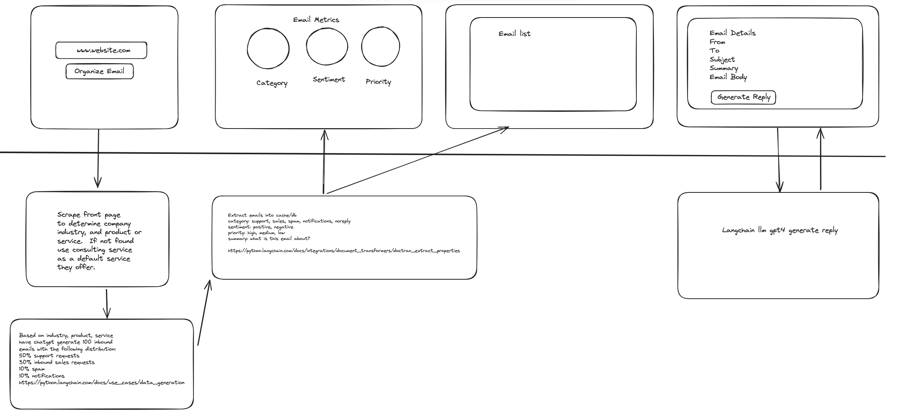

# demo-email-summarizer

## Installation ##

### Make sure you're in an isolated environment ###
```
pyenv virtualenv 3.11.5 demo-email-summarizer
pyenv local 3.11.5/envs/demo-email-summarizer
```

### Install requirements ###
```
pip install -r requirements.txt 
```

## Running in Development ##
```
streamlit run Home.py
```

## Diagram
